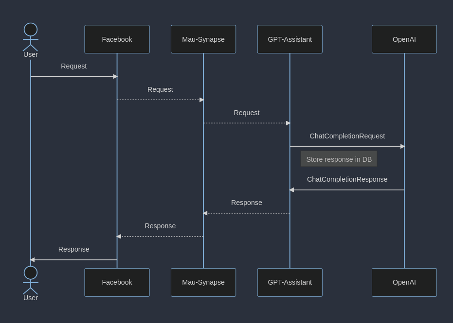
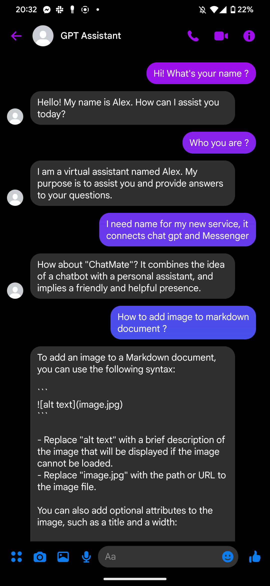

# GPT Assistant
GPT Assistant is a bridge between Facebook Messenger and OpenAI GPT model. 
You can talk with GPT using your personal chat. 

## Connection to Messenger
As this service is directly connected to Synapse (Matrix server, and MAU Facebook Bridge) there is no need to directly connect to Facebook server. 
It can be used as Matrix assistant too!

## System overview

## Example conversation
https://www.youtube.com/shorts/9U9dT6Y0Zdw

